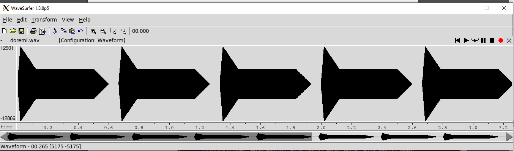
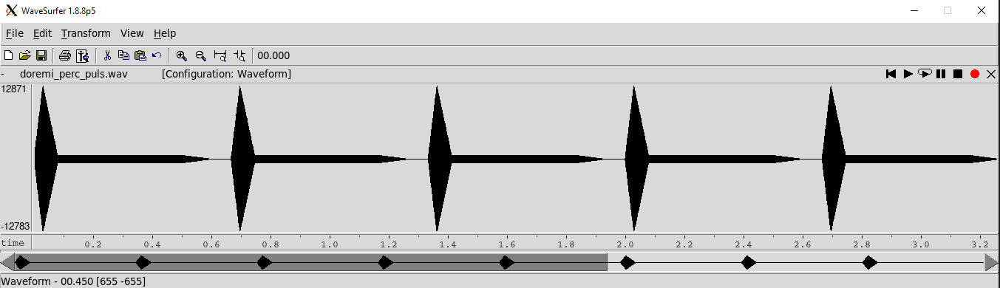
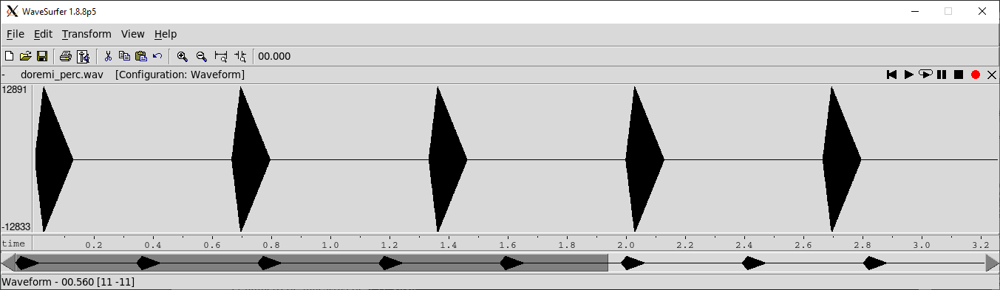
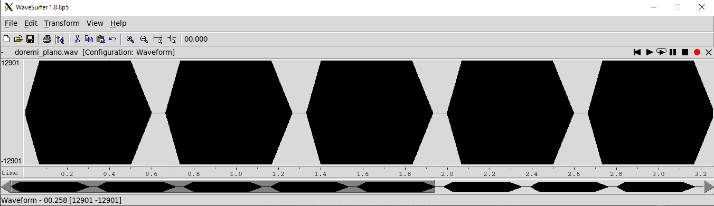
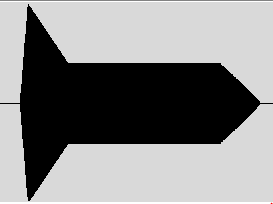
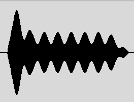
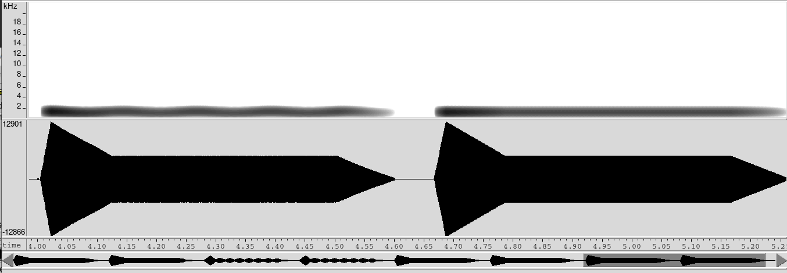

PAV - P5: síntesis musical polifónica
=====================================

Obtenga su copia del repositorio de la práctica accediendo a [Práctica 5](https://github.com/albino-pav/P5) 
y pulsando sobre el botón `Fork` situado en la esquina superior derecha. A continuación, siga las
instrucciones de la [Práctica 2](https://github.com/albino-pav/P2) para crear una rama con el apellido de
los integrantes del grupo de prácticas, dar de alta al resto de integrantes como colaboradores del proyecto
y crear la copias locales del repositorio.

Como entrega deberá realizar un *pull request* con el contenido de su copia del repositorio. Recuerde que
los ficheros entregados deberán estar en condiciones de ser ejecutados con sólo ejecutar:

~~~~~~~~~~~~~~~~~~~~~~~~~~~~~~~~~~~~~~~~~~~~~~~~~~~~~.sh
  make release
~~~~~~~~~~~~~~~~~~~~~~~~~~~~~~~~~~~~~~~~~~~~~~~~~~~~~

A modo de memoria de la práctica, complete, en este mismo documento y usando el formato *markdown*, los
ejercicios indicados.

Ejercicios.
-----------

### Envolvente ADSR.

Tomando como modelo un instrumento sencillo (puede usar el InstrumentDumb), genere cuatro instrumentos que
permitan visualizar el funcionamiento de la curva ADSR.

* Un instrumento con una envolvente ADSR genérica, para el que se aprecie con claridad cada uno de sus
  parámetros: ataque (A), caída (D), mantenimiento (S) y liberación (R).



<p>És el ADSR correspondiente al archivo dumb.orc, los tiempos de ataque, caída i liberación no son especialmente
largos ni cortos y el nivel de mantenimiento tampoco és ni muy alto ni muy bajo. <br> Se aprecian bien las 4 fases</p> 

* Un instrumento *percusivo*, como una guitarra o un piano, en el que el sonido tenga un ataque rápido, no
  haya mantenimiemto y el sonido se apague lentamente.
  - Para un instrumento de este tipo, tenemos dos situaciones posibles:
    * El intérprete mantiene la nota *pulsada* hasta su completa extinción.

  
  <code>InstrumentDumb	ADSR_A=0.03; ADSR_D=0.05; ADSR_S=0.1; ADSR_R=0.1; N=40;</code>
  <p>Es parecido al percusivo de más abajo, pero tiene un pequeño mantenimiento que aguanta un poco la nota. Sigue sonando percusivo, pero hay como un 'eco' al acabar que deja ver que aun hay nota pero no se oye como un instrumento no percusivo.</p> 

    * El intérprete da por finalizada la nota antes de su completa extinción, iniciándose una disminución
	  abrupta del sonido hasta su finalización.

  
  <code>InstrumentDumb	ADSR_A=0.03; ADSR_D=0.1; ADSR_S=0.0; ADSR_R=0.3; N=40;</code>
  <p>Tiene un tiempo de ataque más o menos rápido, la caída igual. No tiene mantenimienot, por lo tanto tampoco liberación. Se escucha como una notificación (usando InstrumentDumb) y tiene un efecto sonoro de "click"</p> 

  - Debera representar en esta memoria **ambos** posibles finales de la nota.

* Un instrumento *plano*, como los de cuerdas frotadas (violines y semejantes) o algunos de viento. En
  ellos, el ataque es relativamente rápido hasta alcanzar el nivel de mantenimiento (sin sobrecarga), y la
  liberación también es bastante rápida.

  
  <code>InstrumentDumb	ADSR_A=0.07; ADSR_D=0.0; ADSR_S=1.0; ADSR_R=0.1; N=40;</code>
  <p>No tiene caída y el nivel de mantenimiento és máximo, esto hace que sea plano y no tengo un "pico" inicial. Ataque  y liberación más o menos rápidos. Suena como un pitido de una alarma (con InstrumentDumb y duracíon corta) pero recuerda un poco a una flauta.</p>

Para los cuatro casos, deberá incluir una gráfica en la que se visualice claramente la curva ADSR. Deberá
añadir la información necesaria para su correcta interpretación, aunque esa información puede reducirse a
colocar etiquetas y títulos adecuados en la propia gráfica (se valorará positivamente esta alternativa).

### Instrumentos Dumb y Seno.

Implemente el instrumento `Seno` tomando como modelo el `InstrumentDumb`. La señal **deberá** formarse
mediante búsqueda de los valores en una tabla.

- Incluya, a continuación, el código del fichero `seno.cpp` con los métodos de la clase Seno.

```cPP
#include <iostream>
#include <math.h>
#include "seno.h"
#include "keyvalue.h"

#include <stdlib.h>

using namespace upc;
using namespace std;

Seno::Seno(const std::string &param) 
  : adsr(SamplingRate, param) {
    // \TODO
  bActive = false;
  x.resize(BSIZE);
  /*
    You can use the class keyvalue to parse "param" and configure your instrument.
    Take a Look at keyvalue.h    
  */
  KeyValue kv(param);
  int N;

  if (!kv.to_int("N",N))
    N = 40; //default value
  
  fi = SamplingRate / N;
  //Create a tbl with one period of a sinusoidal wave, ftbl = FS/N
  tbl.resize(N);
  float phase = 0, step = 2 * M_PI /(float) N;
  index = 0;
  for (int i=0; i < N ; ++i) {
    tbl[i] = sin(phase);
    phase += step;
  }
  }

void Seno::command(long cmd, long note, long vel) {
    /// \TODO diria que está bé pero
  if (cmd == 9) {		//'Key' pressed: attack begins
    bActive = true;
    adsr.start();
    index = 0;
	A = vel / 127.;
    float power = (note - 69.0) / 12.0;
    float f0 = 440 * pow(2.0,power);
    fd = f0 / fi;
    //cout << "Note: " << note << " pow: " << power << " F0: " << f0 << " FD: " << fd << "\n";
  }
  else if (cmd == 8) {	//'Key' released: sustain ends, release begins
    adsr.stop();
  }
  else if (cmd == 0) {	//Sound extinguished without waiting for release to end
    adsr.end();
  }
  /// \aqui haurem de decidir Fm en funció del valor de note
  // note=0 -> f = 8.1758Hz, note=127 -> f = 12544Hz
  // note = 69 + 12 * log2(f0/440)
  // f0 = 440 * 2^((note-69)/12)
   //Frecuencia del senyal que volem generar
  //aquesta es la f a la que volem modular la tabla
  //Fs = 44100Hz (mostreig)
  // La frecuencia de la señal original tbl es Fs/N, en nuestro caso es 1102,5Hz
  //Pero mejor la ponemos en función de las dos variables

  //el factor de diezmado lo encontramos dividiento la f0 (queremos) entre la del señal original
}


const vector<float> & Seno::synthesize() {
    /// \TODO
  if (not adsr.active()) {  // no hay sonido
    x.assign(x.size(), 0);
    bActive = false;
    return x;
  }
  else if (not bActive)     // Tecla no pulsada
    return x;

  for (unsigned int i=0; i<x.size(); ++i) { //Mantenimiento
    //Diezmamos la sinusoide
    float i_floor = index * fd;
    //cout << "Index nou: " << i_floor << " ";
    while (i_floor >= tbl.size())
        i_floor -= tbl.size();      //especie de modulo para que el indice sea un valor válido
    float fd_floor = i_floor - floor(i_floor);
    //cout << fd_floor << "\n";
    i_floor = floor(i_floor);

    x[i] = A * ((1-fd_floor) * tbl[i_floor] + fd_floor * tbl[i_floor+1]);
    index++;

    //if (index == tbl.size())
    //  index = 0;
  }
  adsr(x); //apply envelope to x and update internal status of ADSR

  return x;
}

```


- Explique qué método se ha seguido para asignar un valor a la señal a partir de los contenidos en la tabla,

<p>
Primero hemos buscado la frecuencia deseada en función del valor de la variable *note*, le llamaremos f0. Sabiendo que note = 69 + 12 * log2(f0/440). Entonces f0 = 440 * 2^((note-69)/12).<br>
Previamente teniamos también la frecuencia de la señal de la tabla, el período tiene N muestras, a una frecuencia de muestreo SampleRate de 44100Hz (en nuestro caso). Entonces la frecuencia fundamental de este periodo, llamemosle *fi*, es de 1102,5Hz.<br>
Deseamos convertir una semi-señal de 1102,5Hz en una señal completa de frecuencia F0. Lo que hemos hecho es diezmar la señal como si fuera infinita. Hemos buscado un factor de diezmado FD = f0 / fi, es el que usamos para diezmar la señal original. El valor del indice multiplicado por el FD no suele dar un valor entero, entonces aquí interpolamos la señal para obtener una representación lineal de los dos vecinos entre los que se encuentra este valor. Este nuevo valor de indice debe estar siempre por debajo de la longitud total de la señal original.<br>
Entonces, diezmando y interpolando hemos creado señales nuevos. Escuchando el audio creemos que se oye bastante bien. Respecto a resultados anteriores que hemos hecho, el final se oye bastante limpio y si ruido, y està la escalera bien afinada.
</p>


  e incluya una gráfica en la que se vean claramente (use pelotitas en lugar de líneas) los valores de la
  tabla y los de la señal generada.

  
- Si ha implementado la síntesis por tabla almacenada en fichero externo, incluya a continuación el código
  del método `command()`.

### Efectos sonoros.

- Incluya dos gráficas en las que se vean, claramente, el efecto del trémolo y el vibrato sobre una señal
  sinusoidal. Deberá explicar detalladamente cómo se manifiestan los parámetros del efecto (frecuencia e
  índice de modulación) en la señal generada (se valorará que la explicación esté contenida en las propias
  gráficas, sin necesidad de *literatura*).



<br>


- Si ha generado algún efecto por su cuenta, explique en qué consiste, cómo lo ha implementado y qué
  resultado ha producido. Incluya, en el directorio `work/ejemplos`, los ficheros necesarios para apreciar
  el efecto, e indique, a continuación, la orden necesaria para generar los ficheros de audio usando el
  programa `synth`.


### Síntesis FM.

Construya un instrumento de síntesis FM, según las explicaciones contenidas en el enunciado y el artículo
de [John M. Chowning](https://web.eecs.umich.edu/~fessler/course/100/misc/chowning-73-tso.pdf). El
instrumento usará como parámetros **básicos** los números `N1` y `N2`, y el índice de modulación `I`, que
deberá venir expresado en semitonos.

- Use el instrumento para generar un vibrato de *parámetros razonables* e incluya una gráfica en la que se
  vea, claramente, la correspondencia entre los valores `N1`, `N2` e `I` con la señal obtenida.
- Use el instrumento para generar un sonido tipo clarinete y otro tipo campana. Tome los parámetros del
  sonido (N1, N2 e I) y de la envolvente ADSR del citado artículo. Con estos sonidos, genere sendas escalas
  diatónicas (fichero `doremi.sco`) y ponga el resultado en los ficheros `work/doremi/clarinete.wav` y
  `work/doremi/campana.work`.
  * También puede colgar en el directorio work/doremi otras escalas usando sonidos *interesantes*. Por
    ejemplo, violines, pianos, percusiones, espadas láser de la
	[Guerra de las Galaxias](https://www.starwars.com/), etc.

### Orquestación usando el programa synth.

Use el programa `synth` para generar canciones a partir de su partitura MIDI. Como mínimo, deberá incluir la
*orquestación* de la canción *You've got a friend in me* (fichero `ToyStory_A_Friend_in_me.sco`) del genial
[Randy Newman](https://open.spotify.com/artist/3HQyFCFFfJO3KKBlUfZsyW/about).

- En este triste arreglo, la pista 1 corresponde al instrumento solista (puede ser un piano, flautas,
  violines, etc.), y la 2 al bajo (bajo eléctrico, contrabajo, tuba, etc.).
- Coloque el resultado, junto con los ficheros necesarios para generarlo, en el directorio `work/music`.
- Indique, a continuación, la orden necesaria para generar la señal (suponiendo que todos los archivos
  necesarios están en directorio indicado).

También puede orquestar otros temas más complejos, como la banda sonora de *Hawaii5-0* o el villacinco de
John Lennon *Happy Xmas (War Is Over)* (fichero `The_Christmas_Song_Lennon.sco`), o cualquier otra canción
de su agrado o composición. Se valorará la riqueza instrumental, su modelado y el resultado final.
- Coloque los ficheros generados, junto a sus ficheros `score`, `instruments` y `efffects`, en el directorio
  `work/music`.
- Indique, a continuación, la orden necesaria para generar cada una de las señales usando los distintos
  ficheros.
